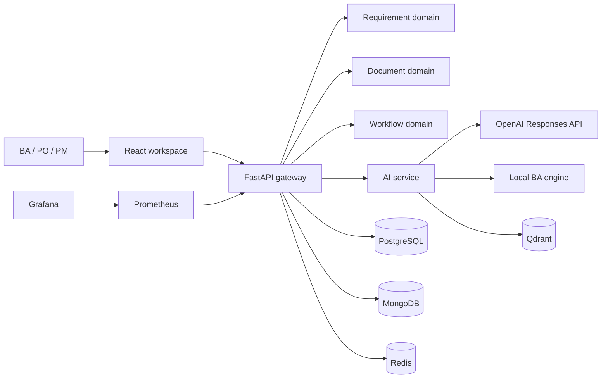

# Solution Architecture

## Context

The current implementation is a modular monolith with explicit domain routes.
This keeps version 1 deployable while preserving service boundaries for later
extraction. PostgreSQL owns transactional lifecycle data. MongoDB is reserved for
large generated-document artifacts, Redis for cache/work queues, and Qdrant for
semantic retrieval.

## Security

- Passwords use PBKDF2-HMAC-SHA256 with unique salts.
- Signed, expiring bearer tokens protect API routes.
- Permissions are resolved server-side from roles.
- AI credentials are read only from backend environment variables.
- Audit events record authentication and protected lifecycle actions.
- Production deployments must rotate `SECRET_KEY`, use HTTPS and external secret management.

## AI behavior

The AI adapter calls the OpenAI Responses API when `OPENAI_API_KEY` exists. If the
provider is unavailable, deterministic classification, quality checks and gap
suggestions keep the workflow usable. Provider metadata is returned with results
so users can distinguish model-backed output from local analysis.

## Scalability path

1. Move document generation to a Redis-backed worker.
2. Store generated artifacts in object storage with metadata in PostgreSQL.
3. Index approved requirements and document chunks in Qdrant.
4. Add read replicas and cursor pagination beyond 10,000 requirements.
5. Split AI and document modules when independent scaling is required.
